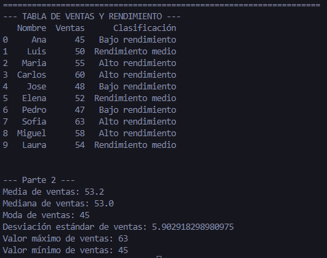

# Practicas de curso IA 🧠

## Tarea Individual Entrenamiento de modelo ML 2️⃣ 
#### File: `EntrenamientoModeloMl.Py`

##### Objetivo
Aplicar estadística descriptiva utilizando Python y pandas, generar una tabla de datos, calcular medidas estadísticas y realizar una predicción simple basada en el comportamiento de los datos.

Simularán que están trabajando con apoyo de un chatbot de inteligencia artificial que les guía en el análisis.

##### Escenario
Una empresa desea analizar el rendimiento mensual de ventas de sus empleados para predecir el comportamiento del próximo mes.

Un chatbot fue entrenado para ayudar a analizar los datos.

Usted debe:

1. `Crear la tabla de datos`
2. `Analizarla`
3. `Interpretarla`
4. `Realizar una predicción simple`

### Datos a utilizar
Ventas mensuales (en miles de pesos) de 10 empleados:
```
Empleado	Ventas
Ana	45
Luis	50
María	55
Carlos	60
José	48
Elena	52
Pedro	47
Sofía	63
Miguel	58
Laura	54
```

### ACTIVIDADES
#### 🔹 PARTE 1 – Crear la Tabla en Python
Utilice pandas para:

- Crear un DataFrame
- Mostrar la tabla
- Agregar una columna que indique:
    - "Alto rendimiento" si ventas ≥ 55
    - "Rendimiento medio" si ventas entre 50 y 54
    - "Bajo rendimiento" si ventas < 50

#### 🔹 PARTE 2 – Estadística Descriptiva
El chatbot debe ayudarle a calcular:

- Media
- Mediana
- Moda (si existe)
- Desviación estándar
- Valor máximo
- Valor mínimo

#### 🔹 PARTE 3 – Visualización
Genere un gráfico de barras mostrando las ventas por empleado.

Explique:

- ¿Quién tiene el mayor rendimiento?
- ¿Se observan diferencias importantes?

## Resultados



## Graficos

#### Rendimiento


#### Ventas por vendedor
